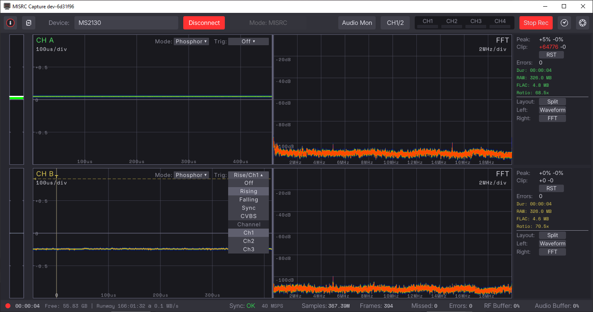
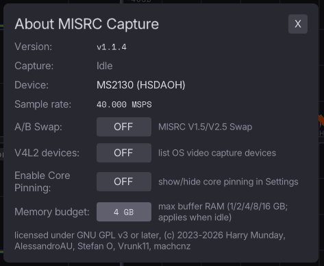
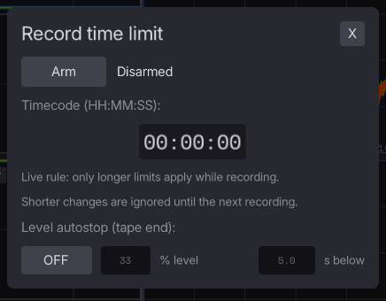
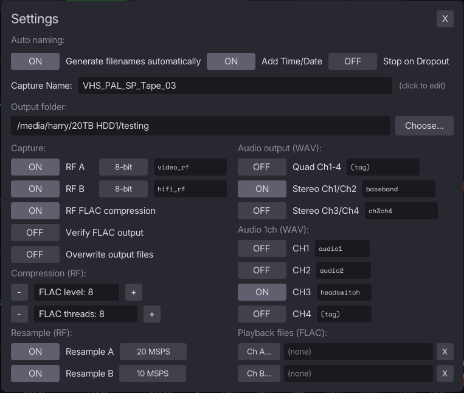
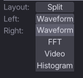
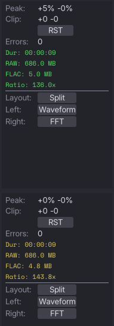
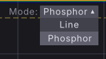
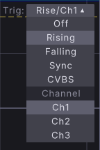

# MISRC GUI


> (Multiple Input Simultaneous RF Capture Graphical User Interface) 

A universal cross platform GUI tool for interfacing with and visualizing monitoring and control of FM RF archival focused, capture device workflows.

### Current Supported Hardware

- [MISRC](https://misrc.org) (v1.0-v1.5a / native v2.5)
- CXADC (single cards and Clockgen Mod with sound)
- HSDAOH
- FX3 (Generic tinkering firmware support)
- DdD (Domesday Duplicator)
- FX3ADC (100mhz MUSE capture device)

## Downloads


Downloads can be found on the [releases page](https://github.com/harrypm/MISRC-GUI/releases).
- Windows
- MacOS
- Linux
- Android (arm64 APK, very alpha)

x86 (AMD/Intel) and ARM64 (Apple M, Snapdragon, RockChip) are fully supported and intended for long-term support. 

Building from source? See [INSTALLATION.md](INSTALLATION.md).


## Setup With Devices


<details closed>
<summary>DdD Setup</summary>
<br>

MISRC GUI supports both legacy DdD firmware and the protocol-v1 firmware family introduced in 3.1. They appear as separate device profiles in the device list.

</details>

<details closed>
<summary>Install Windows</summary>
<br>

For `misrc_capture` to be able to access the MS2130 or MS2131 capture device, you need to install a generic driver:

Firstly download [Zadig](https://zadig.akeo.ie/)

Force the installation of `WinUSB (v6.1.7600.16385)` or `libusb-win32 (v1.2.6.0)` driver on your MS2130/MS2131 adapter, on `interface 0` leave `interface 4` alone. 

```
Interface 0 - USB Video
Interface 4 - HIDDevice
```

</details>

</details>

<details closed>
<summary>Linux CXADC/Clockgen Setup</summary>
<br>

Linux setup note (CXADC DC controls)

For CXADC `DC` up/down controls to work without root, the sysfs parameter files must be writable by the `video` group.

One-time fix for the current boot:

```bash
sudo chgrp video /sys/class/cxadc/cxadc*/device/parameters/*
```

Verify:

```bash
ls -l /sys/class/cxadc/cxadc*/device/parameters/center_offset
```

Expected group is `video` (e.g. `root video`).

</details>


## Building from source on Fedora

The build system is **Meson**. The `CMakeLists.txt` at the repository root is stale and
truncated — it never defines `add_executable`, so it cannot build anything. Do not use it.

Install the dependencies:

```sh
sudo dnf install -y gcc meson ninja-build cmake pkgconf-pkg-config git nasm \
  flac-devel libusb1-devel raylib-devel fftw-devel soxr-devel alsa-lib-devel \
  libX11-devel mesa-libGL-devel libuvc-devel
```

Then build:

```sh
./scripts/build-local.sh
```

Binaries land in `build-local/`. The script calls `scripts/build-deps-unix.sh`, which builds
the vendored `third_party/hsdaoh` into `.deps/install` first (no distro packages it, and the
API used here is the MISRC fork rather than upstream), then configures Meson against system
libraries and runs a smoke test.

> The Fedora-specific `scripts/build-fedora.sh` was removed once upstream's `build-local.sh`
> gained the same coverage. Fedora support now lives in `build-deps-unix.sh` directly: dnf
> package names in its dependency check, and `-DCMAKE_INSTALL_LIBDIR=lib` so the vendored
> hsdaoh install and its `.pc` agree on a multilib distro.

Notes on the Fedora-specific pieces:

- **System FLAC is used directly.** Fedora ships `flac-devel` 1.5.0, which satisfies the
  `>= 1.5.0` requirement for multithreaded encode, so none of the bundled-FLAC machinery the
  CI needs for Ubuntu 22.04 applies here.
- **`fftw-devel`**, not `fftw3f-devel` — Fedora's single package ships all precisions.
- **`libX11-devel` and `mesa-libGL-devel`** are required because the GUI link line appends a
  literal `-lX11 -lGL`, independent of what `raylib.pc` declares.
- **`libuvc-devel`** is only needed to build vendored hsdaoh; Meson never looks for it.
- `scripts/build-appimage-local.sh` is **not** usable natively on Fedora — it asserts a glibc
  2.35 ceiling for AppImage portability and Fedora 44 is glibc 2.43. Use its container mode
  if you need an AppImage.

By default a missing optional dependency silently drops a feature. Pass
`-Dmisrc_gui=enabled`, `-Dfx3=enabled` or `-Dddd=enabled` to turn that into a configure
error instead; `build-local.sh` already sets the first of these.


## Visual Overview & Use


The MISRC GUI, the layout is a simplified command and control system, designed for a single 9-24” monitor both touch & non-touch compatible, with a two layer only rule of design meaning there is no more than one sub menu per button press or drop down selection.



The main GUI window from beginning from the top row

- Information button
- Metadata button
- Device selection box 
- Device mode selection box 
- Audio monitoring enable and disable 
- Audio levels 
- Timer and level stop control 
- Record button

The record timer has to be armed with a manual button click. Armed before a recording, it counts from the recording's start; armed while recording, it counts from the moment you click Arm, so it can never stop a capture by accident. Once it is running, only longer limits apply live.


## Information Page 




- A/B  Swap for older V1.5a users
- V4L2 Device discovery for Linux
- Core Pinning (Linux Only)
- Memory Budget (Allows you to limit/raise the buffers for higher stability on low end or high end systems) 

The GUI is built with several layers of fallback and prevention measures to stop hardware issues on an OS level from interfering with your capture such as spillover if there is a slowdown in drive or encoding performance, the recommended amount of RAM ideally is 8GB DDR3 2400Mhz or better, of course on faster ARM64 chips this becomes less of a concern but production stations should have ideally no less then 16GB total. 


## Record & Audio Monitoring


Record button is clear when not in use.

Record button is RED when capturing is in use.

The record button will turn orange and state finalizing when a file is still being processed i.g adding timing header information or encoding from spill over or memory.

Audio monitoring has on/off and CH 1/2 or Ch 3/4 switching and level indicators in Green/Yellow/Red for visual loudness level. 


## Timer and Level Auto Stop




Timer mode allows for `HH:MM:SS` timing to stop the capture, with an arm/disarm system but will append current duration to the total timer duration and will not allow you to accidentality stop your capture if you forgot to set the timer beforehand. 

Level Autostop, this allows for you to set a overall % level alongside a timer to automatically stop captures when a tape is clearly reached its end and no active signal is being captured thus presenting a drastically lower level, users should be careful with this to prevent re-runs if tapes have spaced recordings.


## Settings Page




- Auto File Naming
- Auto File Date Stamping
- Stop on dropout mode
- Base Name and Output
- A/B RF Capture On/Off
- FLAC/RAW PCM Encoding Control
- Bit-Depth Selection Control (for MISRC/HSDAOH, CXADC)
- FLAC Level & Threads Control
- Stereo/Mono/Quad channel record control for audio (You can select multiple options) 
- Resampling Control for A/B (VHS config 20msps video 10msps hifi shown)
- Playback Input Files


## UI Scale (HiDPI displays)

The interface is laid out in fixed logical pixels, so on a high-density display
it renders small unless it is scaled. MISRC GUI detects the desktop's own scale
(`Xft.dpi` on X11/XWayland, the Windows display scale, the compositor
elsewhere) and draws at the same size as every other app, so a 4K or 5K panel
should be readable without any setup.

On top of that you can zoom. The zoom is relative to the desktop: **100% is the
size of your other apps**, whatever the display's density.

| Action | Shortcut |
| --- | --- |
| Zoom in / out | `Ctrl` + mouse wheel (`Cmd` on macOS) |
| Zoom in | `Ctrl` `+` |
| Zoom out | `Ctrl` `-` |
| Reset to 100% | `Ctrl` `0` |

The zoom ranges from 50% to 200% of the desktop's size in 10% steps and is
saved between runs.

**Settings page → UI scale** exposes the same control, plus:

- **Follow desktop** — when ON (the default), the desktop's scale is the base
  the zoom multiplies, re-detected if the window moves to another monitor.
  Zooming leaves it ON. Turn it OFF only if detection gets your display wrong:
  the desktop then counts as 1x, so 100% is one UI pixel per screen pixel.

Settings files from before the desktop-relative zoom start at 100% of the
desktop with Follow desktop ON. The old `ui_scale_percent` key is still written
(as the resulting scale) so an older build reads a sensible value back.

**Known limitation:** X11 and XWayland report a *single* content scale
(`Xft.dpi`) shared by every monitor, so on a mixed-density X11 desktop the app
cannot tell your displays apart and moving the window will not change the
scale. Use the zoom on the odd panel out. Per-monitor following works where
the compositor reports a per-window content scale.

Run with `--debug-view` to log what was detected:

```
INFO: DISPLAY: content scale 2.00, monitor 0 (5120px/600mm) -> desktop 200%, zoom 100% -> UI scale 200%
INFO: DISPLAY: window 3584x2016 on a 5120x2880 monitor -> 1792x1008 logical at 200%
```


## Scopes & Plugins


There is a unified plugin system for deploying decoders.

Included currently are the following viewer modes.

- Stream Waveform (similar to an oscilloscope) 
- FTT (visualizes peaks of signals carriers i.g video/hifi or your local FM radio)
- CVBS (Basic composite video decoder Luma B/W only currently)




Experimental support for [Tape-Decode](https://github.com/harrypm/tape-decode-rust) (A Rust re-write of vhs-decode) is also a working progress, this plugin hopes to allow for a quick is this working inspection and in the future potentially direct to file decoding however currently this does have massive limitation implications and performance cost implications, so it's not a high priority over the stability of the core feature of seeing there is something and getting it safely captured to file. 

There is plans for a basic quality hi-fi audio decoder mode based off of the GNU radio script, allowing for directional test point finding and quick testing of sanity of if there is a HiFi FM signal present.


## During Capture Readout 


Statistics per channel will be available on the right hand side. 

- Peak RF Level
- Clipping events observed + & - range
- Errors with feed

### Recording statistics

- Duration (HH.MM.SS)
- RAW Data Handled
- Encoded FLAC file size
- Compression Ratio (I.g 8.7x)



After a capture is finished these values will be persistent until a new capture starts or the application is closed.

Persistence config, once you have configured your settings a global configuration file will be saved and this will carry forward onto new versions or older test builds, this allows you to quickly change between builds to test things or to just instantaneously update to the latest version.


## General Monitoring 


- Sync Status  - confirms the current state of connectivity. 
- XXX MSPS     - shows your current rate of the hardware capture device I.g 40msps or 100msps
- Samples      - xxxxGB gives you a rolling number of how many samples have been fed into the application during the current session. 
- Frames       - like samples shows you how many samples are in a frame counter. 
- Missed       - shows you how many frames of data have been missed. 
- Errors       - shows you how many hard dropout or encoder dropout errors there are. 
- RF Buffer    - shows the current level of the ring buffer for RF feeds. 
- Audio Buffer - shows the current level of the ring buffer for audio feeds.

Understanding the waveform scale. 

There are two visualization modes currently implemented. 

- Level Bar (vertical colour indicator)
- Waveform Line
- Waveform Phosphor



On the zero line that is your DC offset position your signal should be level with this position to begin with irrespective of your gain level of the signal of input.

Ideal saturation range at 8-bit is typically within the plus +0.5 and -0.5 range of visualization, of course please do confirm with an oscilloscope and your recorded files before committing to long duration archival visualizations are of a decimated amount i.g (100/1000th samples) of data not an absolute of what is being captured to file.

Trigger modes like an oscilloscope can be done in the simple following. 



Each channel can be triggered by any other channel by selecting the channel trigger mode. 

Channels:

- Ch1 (RF)
- Ch2 (RF)
- Ch3 (MISRC Audio Ch3 or Clockgen Mod Mainboard Headswitching input)

Modes:

- Rising
- Falling
- Sync
- CVBS

There are plans to expand upon these to cover a full range of trigger modes you would typically see inside of an Siglent/Rigol oscilloscope.


## Capture Metadata


The Text Icon opens the **Capture Metadata** panel: what the next recording is *of* (client, title, tape label, format, speed, video system, HiFi, black & white, notes) and who ran it. These values are written to the capture log, to a small JSON sidecar next to the capture, and (the ids) into the RF FLAC files. They are **never saved**: they live outside the settings file, are never sent to or taken from a net peer, and are gone when the GUI closes.

- **Linked.** When another program opens the GUI with a `--session` file that names an `asset` (see *Session launch file* under [CLI & Automated Testing](#cli--automated-testing)), the capture is linked to that asset. The panel shows *From toolkit: &lt;client&gt; · &lt;title&gt;* and every row is read-only: corrections are made in the program that launched the capture, so the files can never disagree with it. The toolbar badge is drawn in the accent colour while linked.
- **Unlinked.** Without a session asset the panel says *Not linked to an asset - these values apply to this run only and are never saved* (amber). You may fill the descriptive rows for this run: free text, digits only for Index, and *- / Yes / No* for HiFi audio and Black & white. Asset ID and Client ID stay *- (not linked)*. After a recording has used the current values the toolbar badge turns amber until you edit one, so last tape's values are noticed before the next tape.
- **Operator** is always read-only: the session's `operator`, or else your OS login name.
- **Locked while recording.** The values are latched when Record starts; nothing typed afterwards can reach that recording's files, so the panel locks until it stops.
- **Net client.** A client that forwards Record to the server cannot edit here (the server's own metadata names the server's files). A **linked** client refuses to forward Record at all, with a dialog: turn on *Record locally*, or launch the capture on the server.
- **RF channels.** When the session asked for RF channels (`rf_channels`) and Channel A / B as they stand now differ from that request, the banner says so, e.g. *Channels differ from the toolkit's request (A on, B off): recording A on, B on*. When it asked for B on a seat with no channel B (one CX card, or a single-channel device), it says *This seat cannot record channel B; the asset is HiFi-equipped*. It is a warning only: the channel toggles stay yours.

Sidecar example (`<base>_<date>_capture_meta.json`, same stem as the capture log; written atomically with `"state": "recording"` when recording starts and rewritten with `"state": "complete"` when it finishes; a failed write is a warning in the log and never stops a recording):

```json
{
  "schema": "misrc-gui.capture-meta/1",
  "state": "complete",
  "linked": true,
  "asset": {
    "client_name": "Kuhn Family",
    "display_name": "Christmas 1994",
    "index": 3,
    "label": "Tape 3",
    "format": "VHS",
    "tape_speed": "SP",
    "video_system": "NTSC",
    "hifi_audio_equipped": true,
    "black_and_white": null,
    "notes": "Label reads \"XMAS 94\".\nTracking noise near the end.",
    "asset_id": "asset_019abc",
    "client_id": "client_7"
  },
  "operator": "Reece",
  "operator_source": "session",
  "session_file": "/captures/incoming/Kuhn_Tape_3.session.json",
  "misrc_gui_version": "v1.2.3-gdh.9",
  "computer_name": "capture-1",
  "device": {"name": "[CXADC] CXADC Clockgen", "type": "cxadc"},
  "capture_format": "FLAC",
  "started_at": "2026-10-02T15:48:19Z",
  "ended_at": "2026-10-02T17:52:03Z",
  "capture_seconds": 7424.112,
  "output_path": "/captures/incoming",
  "base_name": "Kuhn_Tape_3",
  "log_file": "Kuhn_Tape_3_2026.10.02_10.48.19_misrc_capture.log",
  "rf_channels": {"requested": {"a": true, "b": true}, "recorded": {"a": true, "b": false}},
  "files": {
    "rf_a": {"name": "rfA_Kuhn_Tape_3_16-bit.flac", "bits": 16, "sample_rate_hz": 40000000, "samples": 296964480000, "bytes": 268435456000},
    "rf_b": null,
    "video": null,
    "closed_captions": null,
    "audio": {"audio_4ch": null, "audio_2ch_12": "Kuhn_Tape_3_Baseband_stereo_ch1_ch2.wav", "audio_2ch_34": null, "audio_1ch_1": null, "audio_1ch_2": null, "audio_1ch_3": null, "audio_1ch_4": null}
  },
  "result": {"drops": 0, "waits": 12}
}
```

Every key is always present. `index` is an integer or `null`, the two booleans `true`/`false`/`null`, empty strings are `""`, every file name is a basename (the files sit next to the sidecar), times are UTC. While `"recording"`, `ended_at`, `capture_seconds`, `samples`, `bytes` and `result` are `null`. `rf_channels.requested` is the session's `rf_channels` (`null` when it asked for none, or there was no session) and `rf_channels.recorded` the channels this recording used; they differ when the operator changed a toggle or the seat has no channel B.

RF FLAC tags, written when the encoder starts (so a capture that never finishes still carries them), on each channel's file:

| Tag | Value |
|-----|-------|
| `MISRC_ASSET_ID` | the asset id (`""` when unlinked) |
| `MISRC_CLIENT_ID` | the client id (`""` when unlinked) |
| `MISRC_ASSET_LABEL` | the tape label (linked captures only) |
| `MISRC_CAPTURE_LINKED` | `true` / `false` |
| `MISRC_CAPTURE_META` | the sidecar's file name |
| `MISRC_RF_CHANNEL` | `A` / `B` |

Notes are never written to tags; they are in the sidecar and the log.


## Logging 


MISRC GUI has a perpetual logging system, as record is pressed your exact system and record config is saved to your log file along with the [capture metadata](#capture-metadata) (one `Capture metadata <key>: <value>` line per field: `(empty)` for an empty string, `(unset)` for an unset index or yes/no, and notes escaped onto one line as `\n`, `\r`, `\t`, `\\` and `\xHH`; when a session requested RF channels, `rf_channels_requested` and `rf_channels_recorded` lines as `A=on|off B=on|off`), and any configuration changes overall, this will also log any errors or buffering issues such as spillover usage to a temporary file, It will also confirm a file is properly encoded and saved so you know 100% the buffers were cleared correctly.

It is highly recommended to preserve these files alongside your captures, however unlike previous capture applications you're encoded FLAC files we'll have the correct duration on both the RF and standard audio files, and can have common metadata embedded into them. This allows for tools such as [FLAC Chop](https://github.com/harrypm/FLAC-Chop) to easily cut up or target or just remove dead space at the start and end of your capture sets.

This means no need for doing advanced math, simply just note the exact input and output timing positions you wish to make cuts and copy and paste across the different files of your capture sets, however you should also make a note inside of the log file if you do this to your files otherwise the information won't match up and maybe caught by future automated systems for disqualification. 

MediaInfo Metadata Example:

`````
Format :	FLAC
Format/Info :	Free Lossless Audio Codec
File size :	18.0 MiB
Duration :	6 min 55 s
Overall bit rate mode :	Variable
Overall bit rate :	363 kb/s
DURATION_SECONDS :	415.838974
LENGTH :	415839
RF_TOTAL_SAMPLES :	4158389740
RF_SAMPLE_RATE :	10000000
RF_SAMPLE_RATE_KHZ :	10000
`````

Log Example:

``````
[2026-07-31 03:00:26] [INFO] MISRC capture log started (FLAC)
[2026-07-31 03:00:26] [INFO] computer_name: THE-RIPPER
[2026-07-31 03:00:26] [INFO] computer_model_name: unknown
[2026-07-31 03:00:26] [INFO] computer_cores: 32
[2026-07-31 03:00:26] [INFO] user_name: Harry
[2026-07-31 03:00:26] [INFO] operating_system_VERSION: Windows
[2026-07-31 03:00:26] [INFO] misrc_tools_version: dev-6d31f96
[2026-07-31 03:00:26] [INFO] datetime_start: 2026-07-31T03:00:26
[2026-07-31 03:00:26] [INFO] capture_log_path: C:\Users\Harry\Desktop/Test_Capture_2026.07.31_03.00.26_misrc_capture.log
[2026-07-31 03:00:26] [INFO] capture_base_name: Test_Capture
[2026-07-31 03:00:26] [INFO] output_path: C:\Users\Harry\Desktop
[2026-07-31 03:00:26] [INFO] capture_device_name: MS2130
[2026-07-31 03:00:26] [INFO] capture_device_type: hsdaoh
[2026-07-31 03:00:26] [INFO] capture_format: FLAC
[2026-07-31 03:00:26] [INFO] Capture channels: A=on B=on
[2026-07-31 03:00:26] [INFO] CVBS preview state: A=off B=off
[2026-07-31 03:00:26] [INFO] RF settings: bitsA=8 bitsB=8 resampleA=on(20000.0 kHz) resampleB=on(10000.0 kHz)
[2026-07-31 03:00:26] [INFO] Capture limits: capture_limit_seconds=0 record_limit_seconds=0 (record_timer_disarmed)
[2026-07-31 03:00:26] [INFO] Audio monitor: playback=off monitor_ch34=off misrc_mode=on
[2026-07-31 03:00:26] [INFO] MISRC V1.5/V2.5 A/B swap override: off
[2026-07-31 03:00:26] [INFO] Dropout handling: stop_on_dropout=off
[2026-07-31 03:00:26] [INFO] Capture metadata linked: true
[2026-07-31 03:00:26] [INFO] Capture metadata client_name: Kuhn Family
[2026-07-31 03:00:26] [INFO] Capture metadata display_name: Christmas 1994
[2026-07-31 03:00:26] [INFO] Capture metadata index: 3
[2026-07-31 03:00:26] [INFO] Capture metadata label: Tape 3
[2026-07-31 03:00:26] [INFO] Capture metadata format: VHS
[2026-07-31 03:00:26] [INFO] Capture metadata tape_speed: SP
[2026-07-31 03:00:26] [INFO] Capture metadata video_system: NTSC
[2026-07-31 03:00:26] [INFO] Capture metadata hifi_audio_equipped: true
[2026-07-31 03:00:26] [INFO] Capture metadata black_and_white: (unset)
[2026-07-31 03:00:26] [INFO] Capture metadata notes: Label reads "XMAS 94".\nTracking noise near the end.
[2026-07-31 03:00:26] [INFO] Capture metadata asset_id: asset_019abc
[2026-07-31 03:00:26] [INFO] Capture metadata client_id: client_7
[2026-07-31 03:00:26] [INFO] Capture metadata operator: Reece
[2026-07-31 03:00:26] [INFO] Capture metadata operator_source: session
[2026-07-31 03:00:26] [INFO] Capture metadata rf_channels_requested: A=on B=off
[2026-07-31 03:00:26] [INFO] Capture metadata rf_channels_recorded: A=on B=on
[2026-07-31 03:00:26] [INFO] Capture metadata sidecar: Test_Capture_2026.07.31_03.00.26_capture_meta.json
[2026-07-31 03:00:26] [INFO] FLAC settings: level=8 verify=off threads=8
[2026-07-31 03:00:26] [INFO] FLAC affinity: enabled=off cpu_list=(none) support=unsupported
[2026-07-31 03:00:26] [INFO] FILE_PATH_A: C:\Users\Harry\Desktop/rfA_Test_Capture_2026.07.31_03.00.26_8-bit_20msps.flac
[2026-07-31 03:00:26] [INFO] FILE_PATH_B: C:\Users\Harry\Desktop/rfB_Test_Capture_2026.07.31_03.00.26_8-bit_10msps.flac
[2026-07-31 03:00:26] [INFO] Audio outputs: 4ch=off 2ch12=on 2ch34=off
[2026-07-31 03:00:26] [INFO] AUDIO_2CH_12_FILE_PATH: C:\Users\Harry\Desktop/Test_Capture_2026.07.31_03.00.26_Baseband_stereo_ch1_ch2.wav
[2026-07-31 03:00:32] [INFO] Recording stopped: duration=5.33s (00.00.05) rawA=394.00 MB (413138944 bytes) rawB=394.00 MB (413138944 bytes) waits=0 drops=0
[2026-07-31 03:00:32] [INFO] Capture time: 5.17s (00.00.05)
[2026-07-31 03:00:32] [INFO] Processing time: 0.16s (00.00.00)
[2026-07-31 03:00:32] [INFO] Output data: compressedA=9.31 MB (9763449 bytes) compressedB=9.15 MB (9599031 bytes)
[2026-07-31 03:00:32] [INFO] Compression ratio: total_raw=788.00 MB (826277888 bytes) total_compressed=18.47 MB (19362480 bytes) ratio=42.674x
[2026-07-31 03:00:32] [INFO] datetime_end: 2026-07-31T03:00:32
[2026-07-31 03:00:32] [INFO] Capture metadata sidecar complete: Test_Capture_2026.07.31_03.00.26_capture_meta.json
[2026-07-31 03:00:32] [INFO] Session complete
```````


## CLI & Automated Testing

<details closed>
<summary>GUI flags</summary>
<br>

These flags open the GUI window (no capture args):

| Flag | Arg | Description |
|------|-----|-------------|
| `--help` / `-h` | — | Print usage and exit |
| `--version` | — | Print version and exit |
| `--smoke-test` | — | Exit 0 if the binary loads OK (no window) |
| `--debug-view` | — | Verbose runtime logs |
| `--config` | `<path>` | Load settings from `<path>` instead of the platform default |
| `--auto-connect` | — | Auto-trigger server/client connection (requires `--config`) |
| `--session` | `<path.json>` | Pre-fill this run for one capture from a session file (never saved; see below) |
| `--session-selftest` | — | Headless check that a session overlay and asset link are applied, never saved, and that bad files are refused whole (no window) |
| `--capture-meta-selftest` | `[keep_dir] [secs]` | Headless linked FLAC A+B and unlinked RAW recordings from the Simulated device; checks the sidecar, the log block and the FLAC tags (no window; a scratch settings file; outputs kept only in `keep_dir`) |

`--auto-connect` requires `--config <path>` with a server (`net_mode: 1`) or client (`net_mode: 2`) config. Server mode auto-starts capture so RF data flows to clients; client mode auto-connects to the configured server. Without `--config` it exits with an error.

</details>

<details closed>
<summary>Session launch file (<code>--session</code>)</summary>
<br>

`--session <path.json>` lets another program (a capture scheduler, a tape database, a script) open the GUI pre-filled for one capture without changing the operator's saved settings. It is a GUI flag: it opens the window and never switches the binary into headless CLI capture mode. It combines with `--config`. Callers can detect support by checking that `misrc_gui --help` lists `--session`.

```json
{"schema": "misrc-gui.session/1",
 "output_path": "/captures/incoming",
 "output_base_name": "Kuhn_Tape_3",
 "operator": "Reece",
 "asset": {"asset_id": "asset_019abc", "client_id": "client_7",
           "client_name": "Kuhn Family", "display_name": "Christmas 1994",
           "index": 3, "label": "Tape 3", "format": "VHS",
           "tape_speed": "SP", "video_system": "NTSC",
           "hifi_audio_equipped": true, "black_and_white": null,
           "notes": "Label reads \"XMAS 94\".\nTracking noise near the end."},
 "rf_channels": {"a": true, "b": true}}
```

- `schema` is required and must be exactly `misrc-gui.session/1`. Every other key is optional, and only the keys present change anything.
- `output_path` and `output_base_name` set the output folder and base name. A base name only names files while auto naming is on, so a session that sets `output_base_name` also turns auto naming on for the run. Whether the record-start timestamp is appended stays the operator's setting. Neither may be empty, or contain a double quote or a control character (the settings file's own rule).
- `operator` names who runs the capture (otherwise the OS login name is used).
- `rf_channels` turns RF Channel A and B recording on or off for the run (the `capture_a` / `capture_b` settings). Both `a` and `b` are required and must be JSON `true` or `false`; `null`, a string or a number is refused, and unknown keys inside it are ignored with a note on stderr. Without `rf_channels` the channels stay as the operator saved them. The operator can still change either channel during the run, and the hardware still wins (one CX card or a single-channel device turns B off); the [Capture Metadata](#capture-metadata) panel warns when the channels differ from the request, and the capture log and sidecar record both what was requested and what was recorded.
- `asset` **links** the capture to an asset: its fields fill the [Capture Metadata](#capture-metadata) panel read-only for the run and reach the capture log, the `_capture_meta.json` sidecar and the RF FLAC tags.

| Field | Type | Max bytes | Required when `asset` is given |
|-------|------|-----------|-----------|
| `asset_id` | string, `A-Z a-z 0-9 _ . -` | 63 | yes |
| `client_id` | string, `A-Z a-z 0-9 _ . -` | 63 | yes |
| `client_name` | string | 255 | yes |
| `display_name` | string | 255 | yes |
| `label` | string | 255 | yes |
| `format` | string | 31 | yes |
| `index` | integer >= 0, or `null` | - | no |
| `tape_speed` | string (`""` = none) | 31 | no |
| `video_system` | string (`""` = none) | 31 | no |
| `hifi_audio_equipped` | `true` / `false` / `null` | - | no |
| `black_and_white` | `true` / `false` / `null` | - | no |
| `notes` | string (`""` = none) | 8191 | no |
| `operator` (top level) | string | 127 | no |
| `rf_channels` (top level) | `{"a": true/false, "b": true/false}`, both keys | - | no |

- Validation is strict and all-or-nothing. Types are exact: `"3"` for `index`, `2.5`, `-1`, or `"true"` for a yes/no field are refused. Strings must be valid UTF-8 and within their cap. No control characters, except that `notes` may hold line breaks and tabs (CRLF is stored as LF). A key repeated inside `asset` or `rf_channels` is refused. Required fields must be non-empty.
- **Session values are never saved.** The settings file always keeps the operator's own output folder, base name, auto-naming switch, file names and RF channel switches for every key the session set. This holds even if the operator edits one of those fields during the run: the edit lasts for that run only. Settings the session did not touch save normally. Capture metadata is never saved at all.
- Strings are standard JSON (escapes and `\u` sequences are decoded to UTF-8). Unknown keys are ignored with a note on stderr, so newer callers can add keys. The retired `ingest` and `log_tags` objects are ignored the same way.
- If the file is missing, unreadable, larger than 64 KiB, not valid JSON, has a different `schema`, or breaks any rule above, nothing from it is applied -- not the settings, not the link: the GUI prints `[SESSION] ERROR: ...` on stderr, shows a "Session file rejected" dialog (the capture is NOT linked to an asset), and starts with the saved settings. A good file prints `[SESSION] Linked: <client> · <title> (<asset_id>)` and shows it in the status bar.

</details>

<details closed>
<summary>Headless CLI capture mode (full arg list)</summary>
<br>

The GUI binary doubles as the full `misrc_capture` CLI when any capture option is passed. GUI-only flags are processed first; any other arg routes into headless CLI capture mode (no window opens).

Run `misrc_gui --help` to see the full list with descriptions. Complete reference:

| Short | Long | Arg | Description |
|------|-----|-----|-------------|
| `-d` | `--device` | `[index]` | Input device index/name (default: 0) |
| | `--devices` / `--device-list` | — | List available capture devices and exit |
| `-n` | `--count` | `[samples]` | Number of samples to read (0 = infinite) |
| `-t` | `--time` | `[time]` | Capture duration: seconds, `m:s` or `h:m:s` (`-n` takes priority; assumes 40 MSPS) |
| `-w` | `--overwrite` | — | Overwrite any files without asking |
| `-a` | `--rf-adc-a` | `[filename]` | RF ADC A output file (`-` for stdout) |
| `-b` | `--rf-adc-b` | `[filename]` | RF ADC B output file (`-` for stdout) |
| `-x` | `--aux` | `[filename]` | AUX output file (`-` for stdout) |
| `-r` | `--raw` | `[filename]` | Raw data output file (`-` for stdout) |
| `-p` | `--pad` | — | Pad lower 4 bits of 16-bit output with 0 instead of upper 4 |
| `-L` | `--level` | — | Display peak level of RF ADCs |
| `-A` | `--suppress-clip-rf-a` | — | Suppress clipping messages for ADC A |
| `-B` | `--suppress-clip-rf-b` | — | Suppress clipping messages for ADC B |
| | `--8bit-a` | — | Reduce ADC A output from 12-bit to 8-bit (requires SoXR) |
| | `--8bit-b` | — | Reduce ADC B output from 12-bit to 8-bit (requires SoXR) |
| | `--resample-rf-a` | `[kHz]` | Resample ADC A to given sample rate (requires SoXR) |
| | `--resample-rf-b` | `[kHz]` | Resample ADC B to given sample rate (requires SoXR) |
| | `--resample-rf-quality-a` | `[0-4]` | Resample quality ADC A (0=quick ... 4=very high, default: 3) |
| | `--resample-rf-quality-b` | `[0-4]` | Resample quality ADC B (0=quick ... 4=very high, default: 3) |
| | `--resample-rf-gain-a` | `[dB]` | Apply gain during resampling of ADC A (-72 to +72) |
| | `--resample-rf-gain-b` | `[dB]` | Apply gain during resampling of ADC B (-72 to +72) |
| `-f` | `--rf-flac` | — | Compress RF ADC output as FLAC |
| | `--rf-flac-12bit` | — | Set RF FLAC bit depth to 12 instead of 16 (legacy alias) |
| | `--rf-flac-bits` | `[auto/12/16]` | Set the RF FLAC bit depth field |
| `-l` | `--rf-flac-level` | `[0-8]` | RF FLAC compression level (0=lowest ... 8=highest, default: 1) |
| `-v` | `--rf-flac-verification` | — | Enable verification of RF FLAC encoder output |
| `-c` | `--rf-flac-threads` | `[threads]` | Number of RF FLAC encoding threads per file (0 = auto; requires FLAC >= 1.4.0) |
| | `--audio-4ch` | `[filename]` | 4-channel audio output file (`-` for stdout) |
| | `--audio-2ch-12` | `[filename]` | Stereo audio output of inputs 1/2 (`-` for stdout) |
| | `--audio-2ch-34` | `[filename]` | Stereo audio output of inputs 3/4 (`-` for stdout) |
| | `--audio-1ch-1` | `[filename]` | Mono audio output of input 1 (`-` for stdout) |
| | `--audio-1ch-2` | `[filename]` | Mono audio output of input 2 (`-` for stdout) |
| | `--audio-1ch-3` | `[filename]` | Mono audio output of input 3 (`-` for stdout) |
| | `--audio-1ch-4` | `[filename]` | Mono audio output of input 4 (`-` for stdout) |

SoXR resampling and FLAC compression options are only available when the binary is compiled with their respective libraries. Run `misrc_gui --help` to see which options are compiled in for your build.

### Real-world examples

Capture 2 hours of VHS from device 0, both channels, FLAC level 8, 8 threads, resampled to 20 MSPS (A) and 10 MSPS (B), with stereo audio:

```
misrc_gui -d 0 -t 2:00:00 -w -f -l 8 -c 8 -a capture_A.flac -b capture_B.flac --resample-rf-a 20000 --resample-rf-b 10000 --audio-2ch-12 baseband_audio_stereo.wav
```

Capture 30 minutes of Video8 from device 0, channel A only, raw 16-bit FLAC, peak level display, overwrite existing files:

```
misrc_gui -d 0 -t 30:00 -w -f -l 8 -c 8 -L -a video8_rf.flac --audio-2ch-12 baseband_stereo_audio.wav
```

</details>

<details closed>
<summary>Server/Client automated testing</summary>
<br>

Two GUI instances (server + client) can be launched with isolated configs and `--auto-connect` to test the full server/client chain without human intervention.

Create test configs:

```bash
mkdir -p /tmp/misrc-net-tests
cat > /tmp/misrc-net-tests/server_config.json <<'EOF'
{
  "net_mode": 1,
  "net_server_port": 8095,
  "net_server_port_str": "8095",
  "net_client_host": "",
  "net_client_port": 8095,
  "net_client_port_str": "8095"
}
EOF
cat > /tmp/misrc-net-tests/client_config.json <<'EOF'
{
  "net_mode": 2,
  "net_server_port": 8095,
  "net_server_port_str": "8095",
  "net_client_host": "127.0.0.1",
  "net_client_port": 8095,
  "net_client_port_str": "8095"
}
EOF
```

Launch both:

```bash
misrc_gui --config /tmp/misrc-net-tests/server_config.json --auto-connect &
sleep 3
misrc_gui --config /tmp/misrc-net-tests/client_config.json --auto-connect &
```

Verify the chain:

```bash
# Server listening
ss -ltn | grep :8095

# Server /stats responds
curl -s http://127.0.0.1:8095/stats

# Client stderr shows connect + pump startup
grep -E "worker started|pump /rf|pump /baseband" /tmp/misrc-net-tests/client.stderr.log
```

Kill the client and verify the server detects the disconnect and stays alive:

```bash
kill <client_pid>
sleep 3
pgrep -af misrc_gui   # server still alive, client gone
curl -s http://127.0.0.1:8095/stats   # server still serving
```

The `misrc_tools/test/cxadc_remote_capture_ci.sh` script automates this full flow.

```bash
bash misrc_tools/test/cxadc_remote_capture_ci.sh ./build-local/misrc_gui 8095
```

</details>

<details closed>
<summary>CI guard tests</summary>
<br>

Static guard checks (no hardware required):

```bash
python3 misrc_tools/test/ci_guard_tests.py --static-only
```

Capture stability CI (requires a capture device or skips timed capture):
```bash
bash misrc_tools/test/capture_stability_ci.sh misrc_gui misrc_extract /tmp/ci-artifacts
```

</details>

## History

- December 2025 - Initial version presented by AlessandroAU (back and forth tinkering begins)
- February 2026 - First testing version released by Harry Munday
- April 4th 2026 - V1.0.0 Release (Basic HSDAOH support re-working by machcnz and vaguely stable)
- June 3rd 2026  - V1.0.7 Release first overall stable production release
- August 9th 2026 - Official public pushing for adoption and edge case bug finding! 
- August 13th 2026 - Official release!
- August 24th 2026 - SDR Update (RTLSDR support + Waterfall/Spectro view modes) 
- September 10th 2026 - CXADC refresh, Capture server/client/local modes integrated. 
- September 22nd 2026 - CXADC rate/cycle modes, --auto-connect testing flag, FLAC level/threads warnings, clockgen audio cleanup.
